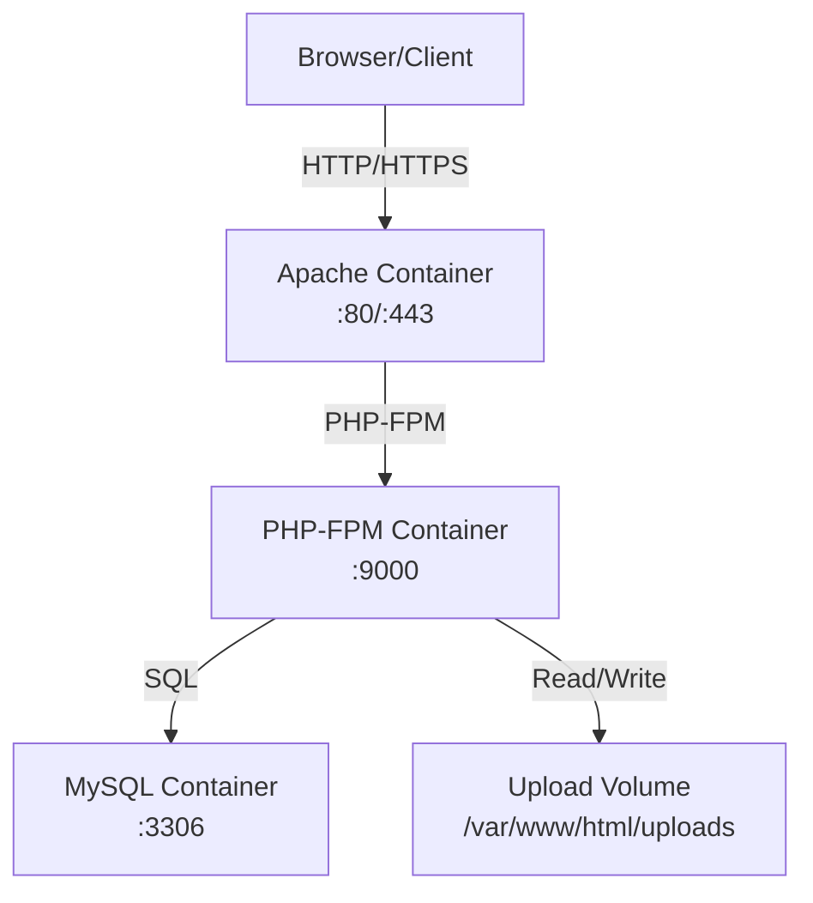

# Docker Setup Plan for osTicket

## Overview
This document outlines the Docker-based deployment architecture for osTicket, a PHP-based support ticket system.

## System Requirements
- **PHP**: Version 8.2 - 8.4 (8.4 recommended)
- **MySQL**: Version 5.5 or greater
- **Web Server**: Apache with mod_php or PHP-FPM

## Architecture



## Container Architecture

### Services

| Service | Image | Ports | Purpose |
|---------|-------|-------|---------|
| `osticket-web` | Custom Apache+PHP | 80, 443 | Web server with PHP |
| `osticket-db` | MySQL 8.0 | 3306 | Database server |
| `osticket-redis` | Redis (optional) | 6379 | Session/Object cache |

### Networks
- `osticket-network`: Internal bridge network for container communication

### Volumes
- `osticket-uploads`: Persistent storage for file uploads
- `osticket-db`: MySQL data persistence

## Component Details

### 1. Web Container (osticket-web)
- **Base Image**: php:8.4-apache
- **Extensions**: mysqli, pdo, pdo_mysql, gd, intl, imap, zip, xml, mbstring
- **Configuration**:
  - Document Root: `/var/www/html`
  - Apache with mod_php
  - Environment variables for configuration

### 2. Database Container (osticket-db)
- **Image**: mysql:8.0
- **Configuration**:
  - Default charset: utf8mb4
  - Collations: utf8mb4_unicode_ci
  - Database created on startup via init script

### 3. Redis Container (osticket-redis) - Optional
- **Image**: redis:7-alpine
- **Purpose**: APCu fallback for distributed caching

## Files to Create

| File | Purpose |
|------|---------|
| `Dockerfile` | Web container image definition |
| `docker-compose.yml` | Service orchestration |
| `.dockerignore` | Build context exclusions |
| `docker-entrypoint.sh` | Container startup script |
| `nginx/default.conf` | Alternative nginx config (optional) |

## Configuration Variables

### Required Environment Variables
```
MYSQL_HOST=osticket-db
MYSQL_DATABASE=osticket
MYSQL_USER=osticket
MYSQL_PASSWORD=<secure-password>
```

### Optional Environment Variables
```
OSTICKET_DEBUG=true
OSTICKET_TIMEZONE=America/New_York
```

## Implementation Steps

1. Create Dockerfile with PHP 8.4 and Apache
2. Create docker-compose.yml defining all services
3. Create .dockerignore to optimize build context
4. Create entrypoint script for first-run setup
5. Test the complete stack

## Build & Run Commands

```bash
# Build and start all containers
docker-compose up -d --build

# View logs
docker-compose logs -f

# Stop all services
docker-compose down
```

## File Structure After Implementation

```
osTicket/
├── Dockerfile
├── docker-compose.yml
├── .dockerignore
├── docker-entrypoint.sh
└── README.docker.md